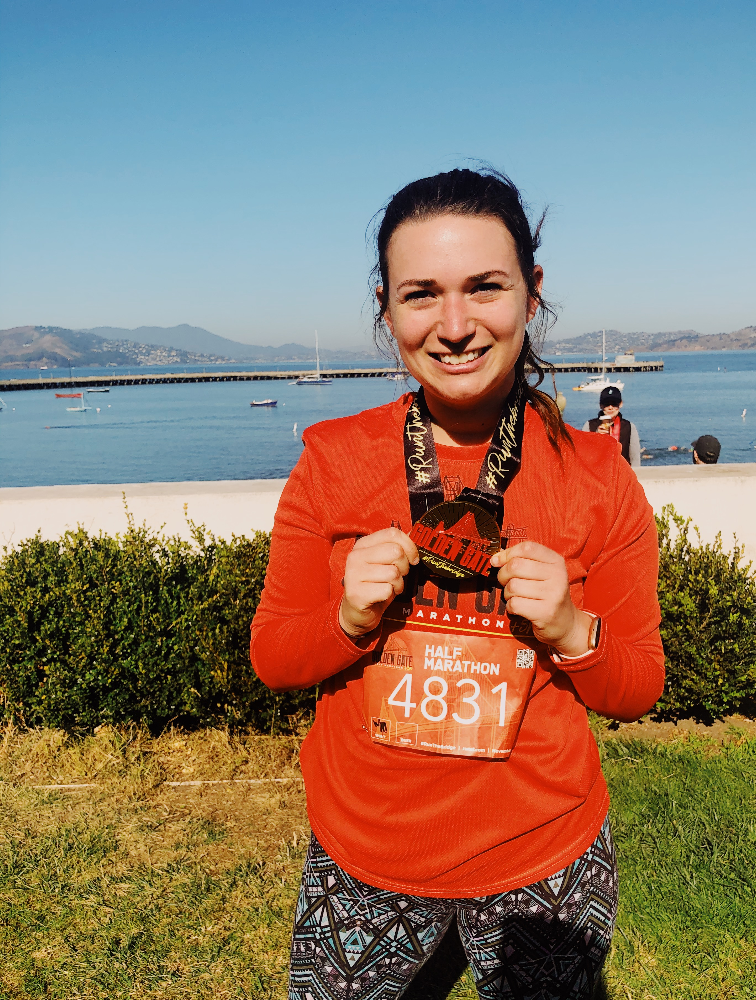

---




```{r echo = FALSE, message = FALSE, warnings = FALSE}
library(tidyverse)
library(rvest)
library(httr)

url <- "https://www.goodreads.com/user/show/65756239-sarah-vititoe"

gr_title <- read_html(url) %>% 
  html_nodes(css = ".bookTitle") %>% 
  html_text() %>% 
  as_tibble() %>% 
  mutate(order = 1:nrow(.)) %>% 
  top_n(-1, order) %>% 
  select(value)
```

### Hi, I'm Sarah! 
I'm an **epidemiologist** and **data enthusiast** currently living in San Francisco, CA.

I love working with data in the healthcare field, but I'm most passionate about projects involving 
**observational studies**, **cancer** and **chronic disease** research, and **patient-centered** 
inniatives. I work mostly in R, but I'm also proficient in SQL and SAS.

I graduated with a **Master of Public Health in epidemiology** from [Columbia University](https://www.mailman.columbia.edu/academics/departments/epidemiology) in May of 2019, 
and have a **Bachelor of Science degree in microbiology and cell sciences** from the [University of Florida](https://catalog.ufl.edu/UGRD/colleges-schools/UGLAS/MCY_BS/) (Go Gators!). 

##### Fun Facts
**Places I've lived:** Gainesville, FL; Washington Heights in New York, NY; Chicago, IL

**Countries visited:** 10 (plus Puerto Rico!) - Mexico, the Dominican Republic, Nicaragua, France, Germany, Poland, Czech Republic, Slovakia, Austria, and Hungary

**Favorite Books this year:** *Recursion* by Blake Crouch, *Severance* by Ling Ma, and *Maybe in Another Life* by Taylor Jenkins Read

**Favorite games:** Pandemic, Settlers of Catan, and bar trivia (This November, I was on a trivia team that won 1st place out of 35 on the topic of the *Harry Potter and the Sorcerer's Stone* book and movie!)

**Half-Marathons run this year:** Women's Shape Half Marathon in April, and the Golden Gate Half in November

**Other Hobbies:** kickboxing/boxing, cooking, and playing the piano


