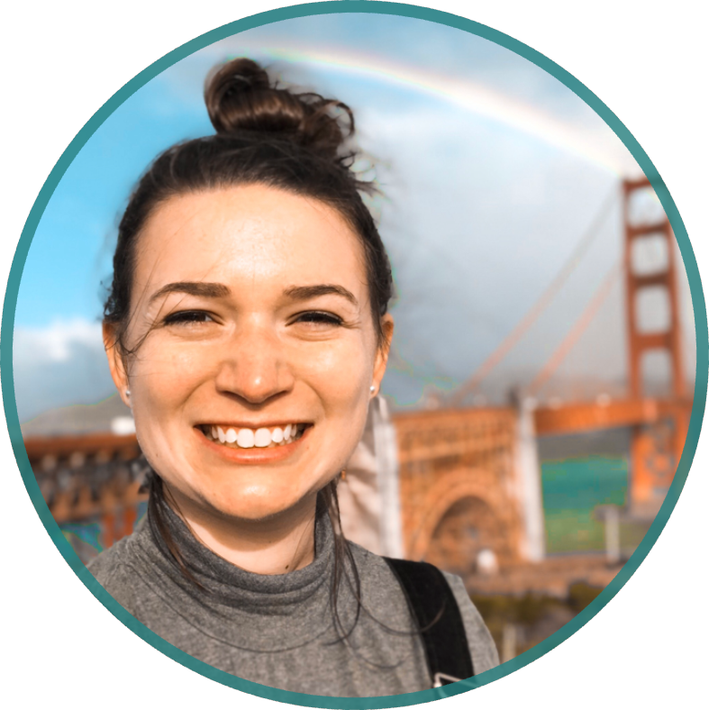

```{r echo = FALSE, message = FALSE, warnings = FALSE}
library(tidyverse)
library(rvest)
library(httr)

url <- "https://www.goodreads.com/user/show/65756239-sarah-vititoe"

gr_title <- read_html(url) %>% 
  html_nodes(css = ".bookTitle") %>% 
  html_text() %>% 
  as_tibble() %>% 
  mutate(order = 1:nrow(.)) %>% 
  top_n(-1, order) %>% 
  select(value)
```

I'm currently based out of **New York, NY**, but I'm moving to the **Bay Area, California** in August 2019.

I'm an **epidemiologist** and **data enthusiast** currently working as a data manager on the chronic disease side of Columbia University's [Center for Infection and Immunity](https://www.mailman.columbia.edu/research/center-infection-and-immunity/chronic-diseases-microbiome).

I love working with data in the healthcare field, but I'm most passionate about projects involving **observational studies**, **cancer** and **chronic disease** research, and **patient-centered** inniatives. I work mostly in R, but I'm also proficient in SQL and SAS.

I graduate with my **Master of Public Health in epidemiology** from [Columbia University](https://www.mailman.columbia.edu/academics/departments/epidemiology) in May of 2019, and have a **Bachelor' of Science in microbiology and cell sciences** from the [University of Florida](https://catalog.ufl.edu/UGRD/colleges-schools/UGLAS/MCY_BS/) (Go Gators!). 

### About Me
- I'm a novice runner, and just ran my first [half marathon](https://www.nyrr.org/races/shapewomen39shalfmarathon) in April 2019!
- I have a certification in beer from the [Cicerone Certification Program](https://www.cicerone.org/)!
- I love to read, and I'm always on the hunt for my [next book](https://www.goodreads.com/user/show/65756239-sarah-vititoe)! I'm currently reading  *`r gr_title`*!


