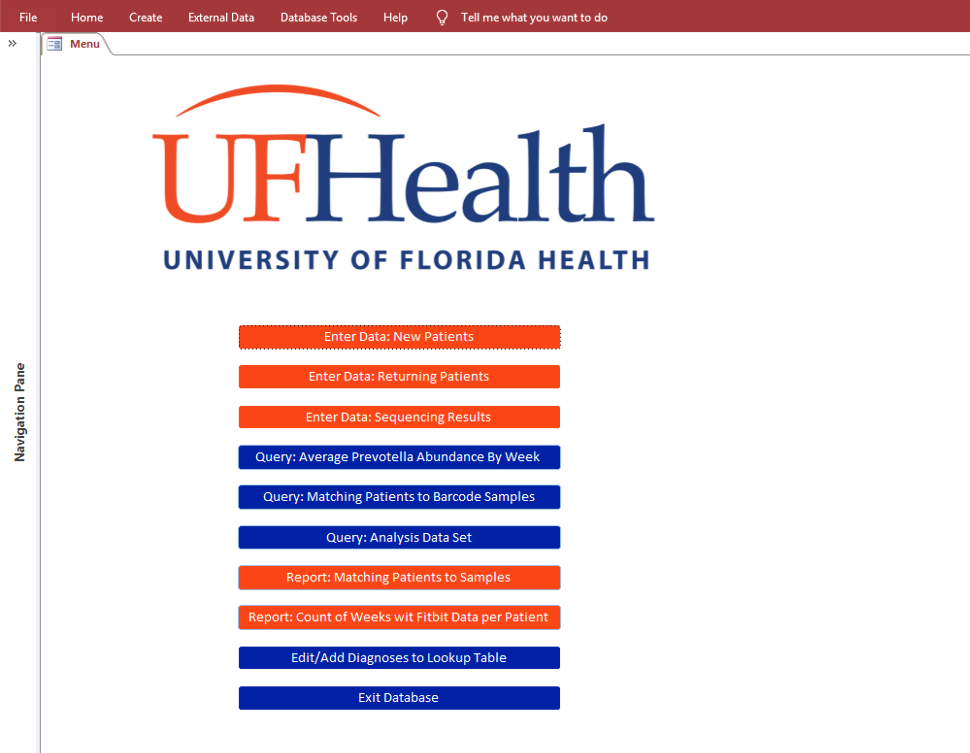

### Background
This database was built as a final project for **P8180: Relational Databases and SQL Programming for Research and Data Science**, by **Professor Debra D'Angelo**. I was enrolled in the course for the Spring semester of 2018 at Columbia, and served as a graduate teaching assistant for the course for one semester in the fall of 2018, and two semesters in the spring of 2019. More information about my TA position can be found [here](cv.html). 

The database was completed in **Microsoft Access**, and queries were written in **SQL**. The database colors were selected to match the University of Florida's branding guidelines, and pay tribute to my alma mater while showcasing my ability to create an on-brand, front-end of my database. It is important to note that the study in this database is fictional, and not affiliated with any academic institution. While only dummy data exists in the database, the database was deisgned to be HIPAA compliant. 

This database is modeled after a simplified version pilot study I had been working on, which was measuring the impact of physicial activity on the gut microbiome. The database includes forms that walk the clinical study team through an intake form at the baseline visit, collection of physical activity variables in subsequent visits, as well as a form to help track lab samples and record their results. All forms include validation rules to guard against data entry errors. The database also includes reports generated from queries of the fictional data in the database.  

### Database
**The database can be downloaded [here](./portfolio/access/vititoe_p8180_database.accdb).** You will need to enter the password *"gators"* in order to access the file. 

