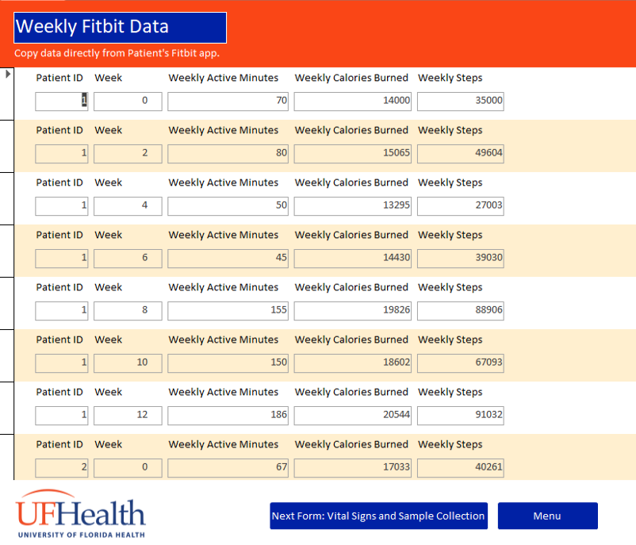
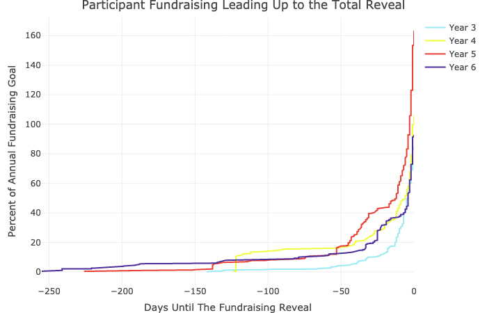

 
# More Projects Coming Soon!

*Projects are categorized by topic, and may be listed more than once if they are relevant to multiple topics. Click on the project title to learn more.*

### Microsoft Access/SQL

- An [Access Database for a Mock Research Study](portfolio_db.html): Final Project for Relational Databases and SQL Programming for Research and Data Science. 

### R/RStudio

- [Fundraising Data Visualizations for a Non-Profit](portfolio_nonprofit.html) in New York

