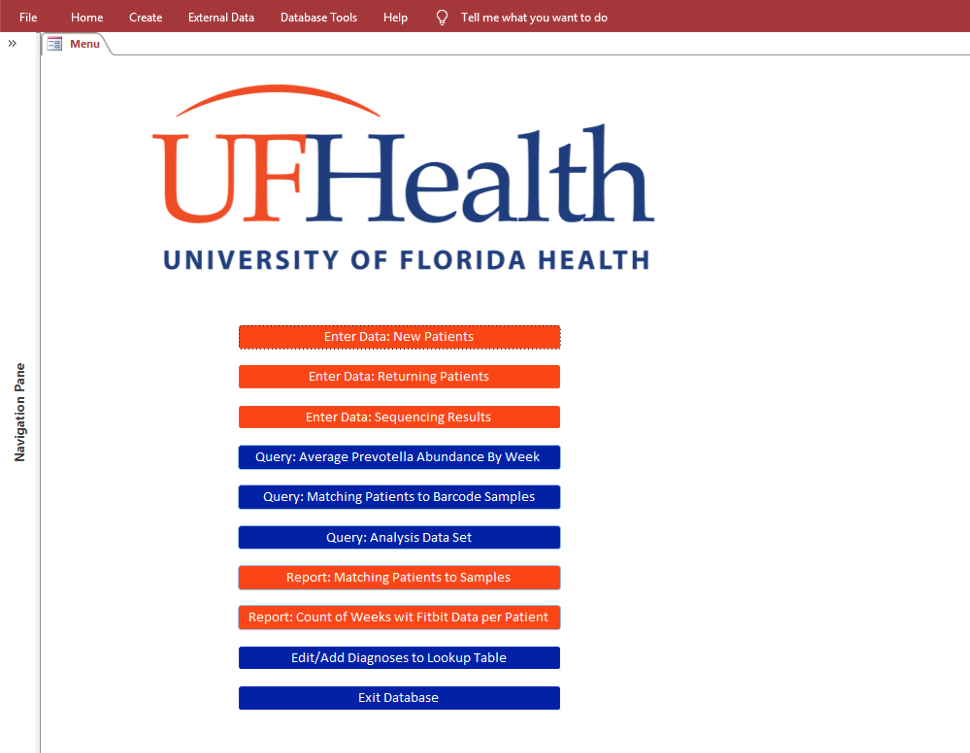

# {.tabset .tabset-pill .tabset-fade}

```{r, message=FALSE, echo = FALSE}
knitr::opts_chunk$set(echo = FALSE)
library(tidyverse)
library(plotly)
library(rvest)
library(httr)
```

## Sample Work in R {.tabset .tabset-pill .tabset-fade}

Below are some highlights of data visualizations I've created for various projects. My favorite R packages to work with include *tidyverse, purrr, data.table, survival, caret, glmnet, randomForest, ggplot2, plotly,* and *markdown.*

### Master's Thesis: CRC Cancer and the Microbiome

**The Role of Gut Microbiota on CpG Island Methylation Phenotype CIMP Colorectal Cancer Tumorigenesis**

The goal of this analysis was to see if there was a relationship between 8 biomarkers of the CIMP subtype of colorectal cancer (methylation markers) and the community of gut microbiota found in biopsied colorectal cancer tumors. 

*(Please note that the plots shown here are for demonstration only and results have not been peer reviewed.)*

#### Example Plot 1


#### Example Plot 2


#### Example Plot 3


### Fundraising Data Visualizations for a Non-Profit in New York


```{r, message=FALSE, echo = FALSE}
knitr::opts_chunk$set(echo = FALSE)
library(tidyverse)
library(plotly)
```

```{r, message=FALSE, echo = FALSE}
d_id <- read_csv("./portfolio/stand/raw/donor.csv", skip = 4) %>% 
  janitor::clean_names() %>% 
  select(donorfirstname, donorlastname) %>% 
  distinct() %>% 
  mutate(donor_id = str_c("d", 1:nrow(.))) 

p_id <- read_csv("./portfolio/stand/raw/participants.csv", skip = 4) %>% 
  janitor::clean_names() %>% 
  select(participantfirstname, participantlastname) %>% 
  distinct() %>% 
  mutate(participant_id = str_c("P", 1:nrow(.))) 

y_id <- tibble( 
  eventfiscalyear = c(2015, 2016, 2018, 2019), 
  stand_year = c("Year 3", "Year 4", "Year 5", "Year 6"))

donor <- read_csv("./portfolio/stand/raw/donor.csv", skip = 4) %>% 
  janitor::clean_names() %>% 
  left_join(d_id) %>% 
  left_join(p_id) %>% 
  left_join(y_id) %>% 
  select(donor_id, participant_id, amount = donationamount, donation_date = donationentereddate,  stand_date = eventenddate, stand_year) 

# read in and clean participants csv
participants <- read_csv("./portfolio/stand/raw/participants.csv", skip = 4) %>% 
  janitor::clean_names() %>% 
  left_join(p_id) %>% 
  left_join(y_id) %>% 
  select(participant_id, stand_year) 
```

#### Background

This analysis was completed to help the executive board of a non-profit in New York understand their donation trends for their year-long fundraising efforts by participants in addition to coprorate sponsorships and fundraising events. The fundrasing season culminated in a final celebration where a fundraising total for the year was revealed to participants. Data in this analysis were derived from querying the fundraising platform, and excludes all funds raised through corporate sponsorship or fundraising events. My role was to help the executive board understand trends in participant-level fundraising efforts over the fundrasing season. 


#### Fundraising Efforts over Time 

Below is a plotly plot I made to help the executive board understand overall donation trends over time. While the original plot contained indentifiable information, these plots have been de-identified, and the fundraising ammounts have been converted into a percentage of the annual fundraising goal to maintain privacy of the organization. 


```{r don_funct}
accumulate_don <- function(df){
  x <- df %>% 
  distinct() %>% 
  mutate_at(vars(stand_date, donation_date), funs(lubridate::as_date(.))) %>% 
  mutate(days_until = as.integer(-(stand_date - donation_date))) %>%
  mutate(stand_year = as.character(stand_year)) %>% 
  distinct(days_until, stand_year, donor_id, amount) %>% 
  mutate(cum_donation = cumsum(amount)) %>% 
  mutate(cum_donation = cum_donation/25000*100) %>% 
  select(stand_year, days_until, cum_donation)
  
  x
}
```

```{r don_plot, fig.width = 10, fig.height = 7}
# apply funciton to each df 
cum_d <- donor %>% 
  mutate(nest_year = stand_year) %>% 
  group_by(nest_year) %>% 
  nest() %>% 
  mutate(data = map(data, accumulate_don)) %>% 
  unnest() %>% 
  select(-nest_year) %>% 
  mutate(stand_year = as.factor(stand_year)) %>% 
  filter(days_until <= 0)

cum_d %>% 
  plot_ly(
    x = ~days_until, 
    y = ~cum_donation,
    hoverinfo = "text",
    split = ~stand_year,
    type = 'scatter',
    mode = 'lines',
    colors = c("#9CEAF5", "#F0FF3D", "#e93f33", "#4d2d99"), 
    color = ~stand_year, 
    text = ~paste(round(cum_donation, 2), "% of our goal fundraised and", -days_until, "day(s)\nto go until the", stand_year, "fundraising total reveal!")
  )%>% 
  layout(
    xaxis = list(
      title = "Days Until The Fundraising Reveal",
      zeroline = F
    ),
    yaxis = list(
      title = "Percent of Annual Fundraising Goal",
      zeroline = F
    ), 
    title = "Participant Fundraising Leading Up to the Total Reveal")
```

#### Fundraising at the Participant Level 
Another goal of the executive board was to look at the trends of individual fundraisers during the Year 5 season to identify the trends of the top fundraisers. After this analysis, we reached out to our top fundraiser (participant #P73) and asked him to share tips and tricks with other participants. Since this plotly plot is interactive, we were also able to quickly compare top fundraisers to each other, or remove outliers like #P73 from our dataset to see what the general trend for the majority of our dancers looked like.

I made a similar plot for the Year 6 fundraising season, and updatd it with new data periodically to help the executive gauge the success of individual fundraisers over time. This way, the leadership team was able to target the individual participant, and provide support, advice, or shoutouts as needed to motivate fundraising.

As a participant myself, I used this chart to evalutate my own fundraising trajectory **(I'm participant #`r p_id %>% filter(participantlastname == "Vititoe") %>%  select(participant_id)`!)**, and to compare my fundraising efforts to our top fundraiser, #P73. Feel free to click on my ID to explore this plot a little more, and see how I compared to other fundraisers!

```{r}
individual_donation_acc <- function(df){
  x <- df %>% 
  distinct() %>% 
  mutate_at(vars(stand_date, donation_date), funs(lubridate::as_date(.))) %>% 
  mutate(days_until = as.integer(-(stand_date - donation_date))) %>%
  mutate(stand_year = as.character(stand_year)) %>% 
  distinct(days_until, stand_year, donor_id, amount, participant_id) %>% 
  group_by(participant_id) %>% 
  mutate(cum_donation = cumsum(amount)) %>% 
  select(stand_year, days_until, cum_donation, participant_id, amount) %>% 
  ungroup()

  x
}
```

```{r, fig.width = 10, fig.height = 7}
i_lvl_cum_d_19 <- donor %>% 
  mutate(nest_year = stand_year) %>% 
  group_by(nest_year) %>% 
  nest() %>% 
  mutate(data = map(data, individual_donation_acc)) %>% 
  unnest() %>% 
  filter(nest_year == "Year 5") %>% 
  select(-nest_year) %>% 
  mutate(stand_year = as.factor(stand_year)) %>% 
  filter(days_until <= 0, is.na(participant_id) == FALSE) %>% 
  mutate(cum_donation = cum_donation/1000*100) 

my_colors <- colors(distinct = TRUE)
set.seed(100)
my_colors <- sample(my_colors, 200)

i_lvl_cum_d_19 %>% 
  plot_ly(
    x = ~days_until, 
    y = ~cum_donation,
    hoverinfo = "text",
    split = ~participant_id,
    type = 'scatter',
    mode = 'lines',
    color = ~participant_id, 
    colors = c("#F0FF3D", "#e93f33", "#4d2d99"), 
    text = ~paste("Dancer", participant_id, "has raised ", cum_donation, "% towards their goal so far, with\n", -days_until, "day(s) to go until the fundraising total reveal!")) %>% 
  layout(
    xaxis = list(
      title = "Days Until The Fundrasing Total Reveal",
      zeroline = F
    ),
    yaxis = list(
      title = "Percent of Fundraising Goal",
      zeroline = F
    ), 
    title = "Participant-Level Fundraising for the Year 5 Season")
```

### My #TidyTuesday Projects {.tabset .tabset-pill .tabset-fade}
A collection of mini-projects completed as part of the [#TidyTuesday](https://github.com/rfordatascience/tidytuesday) initiative by the R for Data Science community. These are just for fun, and something I do to practice my skills!

#### May 7th, 2019: Global Student to Teacher Ratios 
This week's dataset is about student to teacher ratios. My mom has been a teacher for almost two decades now, at the high-school level, so this analysis is dedicated to her! **Happy early mother's day, mom!** The official #TidyTuesday repository can be viewed [here](https://github.com/rfordatascience/tidytuesday/tree/master/data/2019/2019-05-07), and all code used to create these plots can be viewed [here](tidytues_05_09_19.html). 

My mom has spent most of her time teaching at Palm Bay Magnet Senior High School in Melbourne, FL, but two years ago she and my dad moved to Dayton Ohio, and she currently teaches at Trotwood-Madison High School. I think it'd be interesting to see where the student to teacher ratio's fall among these global averages that the #TidyTuesday project shared. I'm going to use data about student:teacher ratios, along with a few other tidbits that would be important to my mom to suggest the ideal country for her to move to.

First, I'm going to try to extract data from the US News and World Rankings for these two schools, so I can add them into our dataset. 

```{r one}
# create a tibble with our URLs for data
mom_hs <- tibble(
  edulit_ind = c("pbhs", "tmhs"), 
  indicator = "Secondary School", 
  country = c("Melbourne, FL, USA", "Trotwood City, OH, USA"),
  country_code = c("FLA", "OHI"),
  year = 2019, 
  url = c( "https://www.usnews.com/education/best-high-schools/florida/districts/brevard-public-schools/palm-bay-magnet-senior-high-school-4695", "https://www.usnews.com/education/best-high-schools/ohio/districts/trotwood-madison-city/trotwood-madison-high-school-15643"), 
  flags = "Data from US News and World Rankings", 
  mom_school = "Yes") %>% 
  group_by(edulit_ind, country, url) %>% 
  nest() %>% 
  # extract the nodes with the data for student ratios
  mutate(url = map(url, ~read_html(.))) %>% 
  mutate(url = map(url, ~html_nodes(., ".display-inline-for-small-only"))) %>% 
  mutate(url = map(url, ~html_text(.))) %>% 
  mutate(url = map(url, ~as_tibble(.))) %>% 
  mutate(url = map(url, ~filter(., str_detect(value, "\\:")))) %>% 
  unnest() %>% 
  separate(value, into = c("student_ratio", "student_ratio_denom"), by = "\\:") %>% 
  mutate(student_ratio = as.numeric(student_ratio)) %>% 
  select(-student_ratio_denom)
```

[Palm Bay Magnent High School](https://www.usnews.com/education/best-high-schools/florida/districts/brevard-public-schools/palm-bay-magnet-senior-high-school-4695) has a student:teacher ratio of **`r mom_hs %>% filter(edulit_ind == "pbhs") %>% select(student_ratio)`:1**, and [Trotwood Madison High School](https://www.usnews.com/education/best-high-schools/ohio/districts/trotwood-madison-city/trotwood-madison-high-school-15643) has a student:teacher ratio of **`r mom_hs %>% filter(edulit_ind == "tmhs") %>% select(student_ratio)`:1**. 

Now, we'll join the data from mom's high school to the dataset from #TidyTuesday. We'll also filter to get only secondary schools, and select only the data that's the most recent. We also have quite a few data points that aren't countries, but rather regions, so we'll get rid of those too. 

```{r, message = FALSE}
student_ratio <- read_csv("https://raw.githubusercontent.com/rfordatascience/tidytuesday/master/data/2019/2019-05-07/student_teacher_ratio.csv")

schools <- student_ratio %>% 
  mutate(mom_school = "No") %>% 
  select(-flag_codes) %>% 
  union(mom_hs) %>% 
  filter(str_detect(indicator, "[Ss]econdary"), str_detect(country_code, "[A-Za-z][A-Za-z][A-Za-z]") == TRUE) %>% 
  group_by(edulit_ind, indicator, country, country_code) %>% 
  top_n(1, year) %>% 

  group_by(country, country_code, mom_school) %>% 
  summarise(student_ratio = as.numeric(mean(student_ratio, na.rm = TRUE)), student_ratio = round(student_ratio, 1)) %>% 
  filter(!is.nan(student_ratio)) %>% 
  ungroup()
```

And now we have a map of student-teacher ratios! Every country is represented by their two-digit country code, while PBMHS is represented by the code "FL", and TMHS is represented by the code "OH". Tile location approximates country/school geography. 

```{r, message = FALSE}
world <- read_csv("./portfolio/tidy tuesday/worldtilegrid.csv") %>% 
  add_row(alpha.2 = "OH", alpha.3 = "OHI", x = 2, y = 1, region = "Americas", sub.region = "Northern America") %>% 
  add_row(alpha.2 = "FL", alpha.3 = "FLA", x = 2, y = 2, region = "Americas", sub.region = "Northwen America") %>% 
  select(alpha.2, alpha.3, x, y, region, sub.region) %>% 
  inner_join(schools, by = c("alpha.3" = "country_code")) %>% 
  mutate(alpha.2 = ifelse(is.na(alpha.2) == TRUE, "NA", alpha.2))

map <-png::readPNG("./portfolio/tidy tuesday/world_outline.png")

ggplot(world, aes(xmin = x, ymin = y, xmax = x + 1, ymax = y + 1, fill = student_ratio)) +
  annotation_custom(grid::rasterGrob(map, 
                                 width = unit(1,"npc"), 
                                 height = unit(1,"npc")), 
                      -Inf, Inf, -Inf, Inf) +
  geom_rect(color = "white") +
  theme_minimal() +
  theme(panel.grid = element_blank(), axis.text = element_blank(), axis.title = element_blank(), legend.position = "bottom") +
  geom_text(aes(x = x, y = y, label = alpha.2), color = "white",  nudge_x = 0.5, nudge_y = -0.5, size = 3) +
  scale_y_reverse() + 
  viridis::scale_fill_viridis(option = "inferno", end = .9, trans = "log", name = "Student to Teacher Ratio", breaks = c(6, 17, 40, 90), labels = c("6:1", "17:1", "40:1", "90:1"), direction = -1)
```

Since there are `r schools %>% select(country_code, country, student_ratio) %>% filter(student_ratio <= 19) %>% filter(country_code != "FL" & country_code != "OH") %>%  tally()` countries with a student ratio that's at least as good as her current skills, we need to narrow down my mom's options a little bit more. Knowing my mom, she'll want to live somewhere that's relatively close to family. My little sister is hoping to move to Germany, my brother and quite a few other family members live in Illinois, and I'll be living in Califonia soon, and we have family and friends in Florida. Keeping that in mind, let's limit our search to Europe (except for Northern-Europe - too cold!), North America, Central America, and the Caribbean, and have a student teacher ratio as good or better than 19:1. 

```{r}
world %>% 
  filter(region %in% c("Americas", "Europe"), sub.region != "South America", sub.region != "Northern Europe", student_ratio <= 19) %>% 
  arrange(student_ratio) %>% 
  mutate(country = reorder(country, student_ratio)) %>% 
  ggplot(aes(x=country, y=student_ratio)) +
    geom_segment( aes(x=country ,xend=country, y=0, yend = student_ratio), color="grey") +
    geom_point(size=3, aes(color = mom_school)) +
    coord_flip() +
    theme_minimal() + 
    theme(
      panel.grid.minor.y = element_blank(),
      panel.grid.major.y = element_blank(),
      legend.position="none"
    ) + 
  viridis::scale_color_viridis(discrete = TRUE, begin = .5, end = .8, option = "inferno") +
  labs(y  = "Students per Teacher in Secondary Schools", x = "")
```

Here you go mom! Hope this gives you some ideas next time you're brainstorming a dream country to move to!

## Sample Work in SQL/Relational Databases

### Access Database for a Mock Study
**Final Project for Relational Databases and SQL Programming for Research and Data Science.**

#### Background
This database was built as a final project for **P8180: Relational Databases and SQL Programming for Research and Data Science**, by **Professor Debra D'Angelo**. I was enrolled in the course for the Spring semester of 2018 at Columbia, and served as a graduate teaching assistant for the course for one semester in the fall of 2018, and two semesters in the spring of 2019. More information about my TA position can be found [here](cv.html). 

The database was completed in **Microsoft Access**, and queries were written in **SQL**. The database colors were selected to match the University of Florida's branding guidelines, and pay tribute to my alma mater while showcasing my ability to create an on-brand, front-end of my database. It is important to note that the study in this database is fictional, and not affiliated with any academic institution. While only dummy data exists in the database, the database was deisgned to be HIPAA compliant. 

This database is modeled after a simplified version pilot study I had been working on, which was measuring the impact of physicial activity on the gut microbiome. The database includes forms that walk the clinical study team through an intake form at the baseline visit, collection of physical activity variables in subsequent visits, as well as a form to help track lab samples and record their results. All forms include validation rules to guard against data entry errors. The database also includes reports generated from queries of the fictional data in the database.  

#### Database
**The database can be downloaded [here](./portfolio/access/vititoe_p8180_database.accdb).** You will need to enter the password *"gators"* in order to access the file. 




