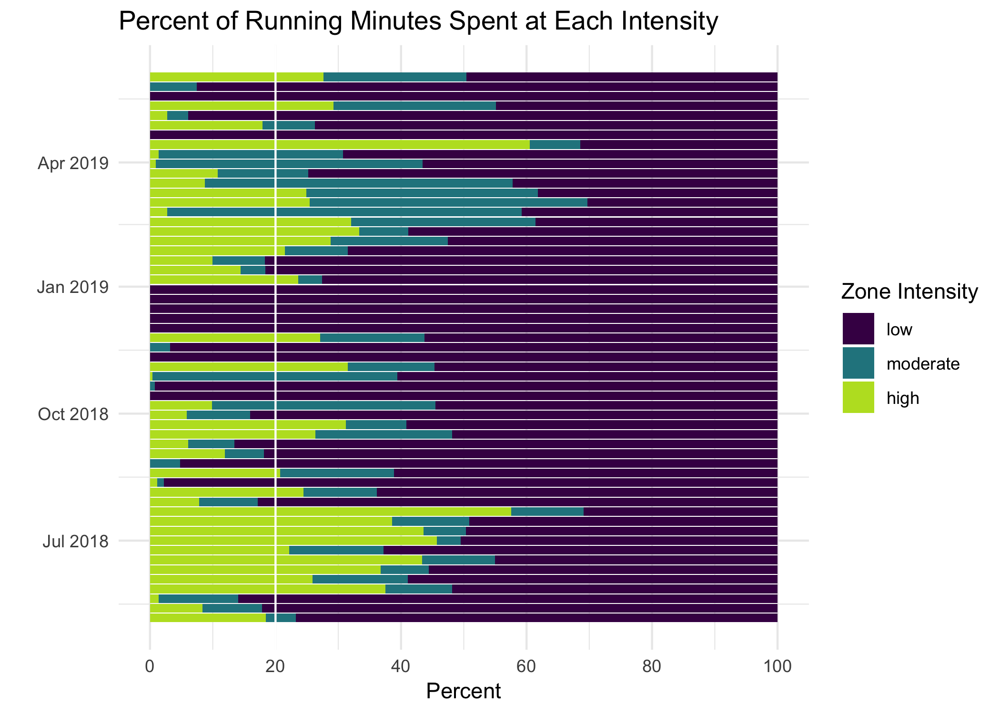

 
# More Projects Coming Soon!

*Projects are categorized by topic, and may be listed more than once if they are relevant to multiple topics. Click on the project title to learn more.*

### Microsoft Access/SQL

- An [Access Database for a Mock Research Study](portfolio_db.html): Final Project for Relational Databases and SQL Programming for Research and Data Science. 

### R/RStudio

- [Fundraising Data Visualizations for a Non-Profit](portfolio_nonprofit.html) in New York

- [My #TidyTuesday Projects](tidy_tuesday.html): A collection of mini-projects completed as part of the [#TidyTuesday](https://github.com/rfordatascience/tidytuesday) initiative by the R for Data Science community. These are just for fun, and something I do to practice my skills!

- [Visualizations of my Charge 2 Fitbit Data](fitbit.html): A few quick analyses and visualizations I made of my personal fitbit data to help me assess my progress as a runner!

